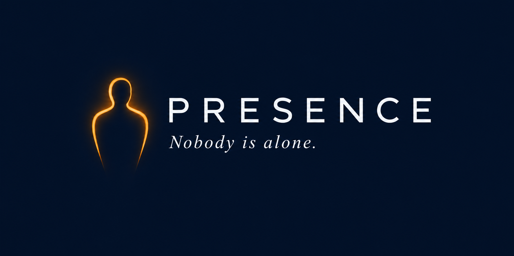

<!-- PRESENCE — Logo -->

  

<h1 align="center">PRESENCE</h1>
<h3 align="center"><i>Nobody is alone.</i></h3>

  <strong>Holographic presence for isolated environments.</strong>

  🇺🇸 English | 🇧🇷 <a href="README.pt-BR.md">Português</a>

  <a href="#-the-problem">The Problem</a> •
  <a href="#-the-solution">The Solution</a> •
  <a href="#-how-it-works">How It Works</a> •
  <a href="#-roadmap">Roadmap</a> •
  <a href="#-how-to-contribute">How to Contribute</a>

---

## 🌌 The Problem

Millions of people work and live in isolated environments:
- Astronauts on the ISS and future Mars missions
- Nuclear submarine crews
- Oil and gas platform workers
- Researchers in Antarctica
- Miners in remote deserts
- Long-haul cargo ship sailors

Loneliness is not just an inconvenience. It is an **operational and mental health risk**. NASA, ESA, and energy companies invest millions in psychological support programs. But current video calls fail at a crucial point: **a screen is not presence.**

## 💡 The Solution

**PRESENCE** brings loved ones into the work environment. Not as an image. As a presence.

A silhouette that walks alongside. A voice that talks. A figure that appears in the hallway, the mess hall, the cabin. Real, alive, present — even from thousands of kilometers away.

It is not an avatar. It is the **real person**, animated by AI, through a normal call.

## ⚙️ How It Works

The concept is built on four pillars:

1. **Single Registration:** The person is captured in 3D once (standing, 360 degrees). The AI learns the face, body, voice, and mannerisms.
2. **Normal Call:** No real-time capture equipment is needed. You just call. Your voice is transmitted like any regular call.
3. **AI Animation:** The artificial intelligence analyzes voice tone, rhythm, and context to animate the digital twin in real-time — moving the mouth, gestures, and body.
4. **Appearance in Environment:** The silhouette is rendered in the isolated person's space through AR glasses, surface projection, or volumetric displays.

### Why the "Silhouette"?
In environments with controlled lighting, projecting a sharp hologram competes with ambient illumination. The **silhouette** (a luminous outline) solves this poetically and functionally: the human brain fills in the details when it sees movement and hears a voice. It is about presence, not perfection.

## 🗺️ Roadmap

- [ ] **Phase 1 — Proof of Concept (2026):** Laboratory prototype with AR glasses and 3D capture.
- [ ] **Phase 2 — Pilot in Real Environment (2027):** Testing on an oil platform, Antarctic station, or ship.
- [ ] **Phase 3 — Scale (2029):** Standardization and deployment across multiple isolated environments.
- [ ] **Phase 4 — Space (2032+):** Adaptation for microgravity and long-duration missions.

## 🤝 How to Contribute

PRESENCE is an open project and needs brilliant minds to become a reality. We are looking for:

- **Unity / Unreal Engine Developers** (rendering and 3D pipeline)
- **AI Specialists** (audio, computer vision, procedural animation)
- **3D Designers** (mesh optimization and Gaussian Splatting)
- **Mental Health Researchers** (psychological impact metrics)
- **Institutional Partners** (space agencies, energy companies, defense)

Read [CONTRIBUTING.md](CONTRIBUTING.md) to learn how to get started.

## 📄 License

This project is licensed under the **Apache License 2.0**. See the [LICENSE](LICENSE) file for more details.

---

  <i>Nobody is alone.</i>

